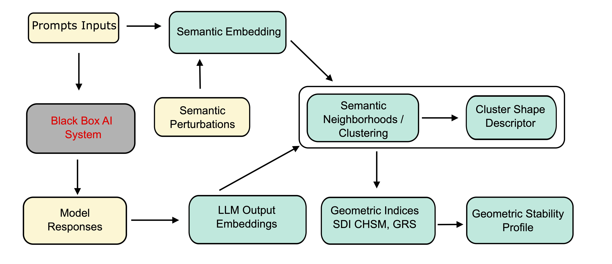

# LLM Reliability Pipeline

This repository contains the evaluation pipeline for the **LLM Reliability** project. The pipeline is designed to compute geometric and statistical reliability indices for various Large Language Models (LLMs) and correlate those internal metrics (SDI, CHSM, GRS) with external leaderboard benchmarks using a Bayesian Q-Model.

## Installation

Before running the pipeline, ensure you have the required Python dependencies installed. You can install them using pip:

```bash
pip install -r requirements.txt
```

## Pipeline Overview



The evaluation pipeline consists of four main steps:

1. **Shape Descriptors & Clustering (`prepare_shape_descriptors.py`)**
   - Loads the prompt and response datasets.
   - Computes text embeddings using a lightweight SentenceTransformer model.
   - Performs bootstrapping/resampling of the data points.
   - Clusters the generated data representations using K-Means.
   - Computes geometric shape descriptors (e.g., Convex Hull Volume, Area, KDE) for the clusters.

2. **Reliability Indices Computation (`run_algorithm1.py compute`)**
   - For a given `K` (number of clusters), computes three core reliability metrics:
     - **SDI:** Semantic Drift Index
     - **CHSM:** Convex Hull Surface Modification
     - **GRS:** Global Robustness Score
   - Saves these computed internal indices per seed.

3. **Metrics Aggregation (`run_algorithm1.py aggregate`)**
   - Aggregates the computed indices across multiple `K` values (e.g., 10, 20, 30, 40).
   - Outputs easy-to-parse CSV files (`SDI.csv`, `CHSM.csv`, `GRS.csv`).

4. **Q-Model Inference (`run_Qmodel.py`)**
   - Fuses the computed internal reliability indices (SDI, CHSM, GRS) with external expert assessments (e.g., MMLU-PRO, GPQA, MATH) sourced from standard LLM leaderboards.
   - Uses a Bayesian hierarchical model (via PyMC) anchored to a specific external expert to estimate a latent true consensus score for each LLM.

## Execution Guide

You can run the entire pipeline end-to-end using the provided shell script.

```bash
# From the LLM-Reliability root directory:
./scripts/run_pipeline.sh
```

### Generated Output Directories

By default, the script isolates all generated data into the root `LLM-Reliability/` directory to keep the `scripts/` folder clean:

- `embeddings/`: Contains the cached `embeddings.npy` and `texts.json`.
- `resample2k3k-initial/`: Contains the initial bootstrapping samples.
- `resample2k3k/`: Contains the clustering results and shape descriptors structured by `K`.
- `outputs-rel_indices/`: Contains the aggregated metric CSVs and the final PyMC `Qmodel-*.pkl` output.

### Configuration

If you need to tweak the experiment hyperparameters (e.g., sample size, seeds, K values, or the anchor expert), you can easily modify the configuration block at the top of [`scripts/run_pipeline.sh`](scripts/run_pipeline.sh).

To add or modify the evaluated LLMs, prompt datasets, or leaderboard scores, edit the configuration constants in [`scripts/experiment_config.py`](scripts/experiment_config.py).
